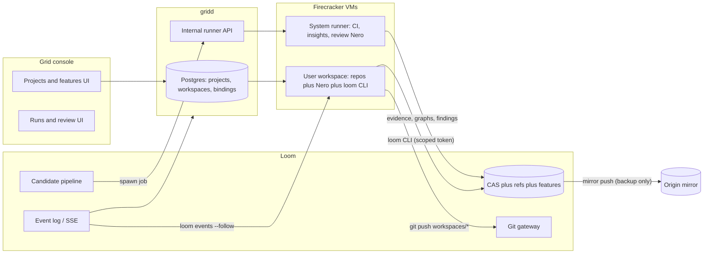

# Grogan platform: Grid x Loom x Nero

Status: accepted design, 2026-08-20. This document is the integration contract
between the three repos. Each phase lists the repo-level work; implementation
details live with the code.

## Intent

Three tools exist today that barely talk to each other:

- **Loom** — smart repository: content-addressed source, feature contracts
  instead of PRs, lightning CI, Git compatibility gateway.
- **Grid** — workstation platform: Firecracker microVMs, console, SSH, previews.
- **Nero** — coding agent (Grok Build fork): TUI, headless, ACP, skills, hooks.

Target shape:

- **Loom replaces Origin/GitHub entirely**: it is the git host, the CI/CD
  system, and the code-review system. Origin is demoted to a dumb push mirror
  (offsite backup only).
- **Grid is the compute plane**: user workspaces *and* the hidden system
  runners that execute Loom CI, static analysis, and review sessions.
- **Nero is the agent everywhere**: interactive in workspaces, autonomous as a
  review agent, and a first-class Loom actor (the "agent factory" talks to
  Loom more than the human does).
- **Projects** are the unifying entity: a project binds Loom repos and carries
  shared state (secrets, memory, skills) across all of its workspaces.

## Roles after integration

| Concern | Owner | Notes |
| --- | --- | --- |
| Source of truth (code, refs, history) | Loom | CAS + refs; git is a gateway |
| Feature lifecycle (contracts, gates) | Loom | draft -> approve -> candidate -> accept |
| CI execution | Grid system runners | Loom orchestrates, Grid executes |
| Static analysis / insights | Grid system runners | results stored in Loom |
| Code review | Nero in system runners | findings stored in Loom, HITL/AITL apply |
| Projects, workspaces, VM lifecycle | Grid | Postgres + Firecracker |
| Interactive agent | Nero in user workspaces | ACP via console, SSH via Cursor |
| Deploy/CD | Loom | fail-closed apply, keyed to Loom evidence |
| Offsite backup | Origin | mirror push only, never read |

## 1. Projects (Grid, server-side)

Replace the console's localStorage folders with a real entity in gridd's
Postgres. A project is the container for repos, workspaces, and shared state.

Tables (all in `internal/store`):

- `projects`: `id` (`prj-xxxxxxxx`), `user_id`, `name`, `color`,
  `notes` (shared agent/human context, see below), `settings` JSONB
  (default vCPU/RAM/disk, review policy), timestamps.
- `project_repos`: `project_id`, `repo` (Loom repo name), `default_ref`
  (usually `refs/main`), `path` (checkout dir name), `position`.
- `project_env`: `project_id`, `key`, `value_enc` (AES-256-GCM via the
  existing vault key, same as Nero credentials). Injected into every
  workspace of the project as environment + `~/.config/grid/project.env`.

What a project carries across its workspaces:

- **Repo bindings** — which Loom repos, at which default refs.
- **Secrets/env** — API keys, service URLs.
- **Shared memory** — `projects.notes` is a markdown document materialized
  into every workspace at `/home/workspace/.agents/PROJECT.md` and referenced
  from the baked `AGENTS.md`. Agents append durable knowledge back through
  the gridd API (`PATCH /v1/projects/{id}/notes`), so learning in one
  workspace is visible in the next.
- **Skills** — optional per-project skills stored in the project and
  materialized into `.agents/skills/` alongside the baked platform skills.
- **Defaults** — VM sizing, review policy (advisory vs blocking).

Mono-repo vs multi-repo: a mono-repo project has one `project_repos` row and
many workspaces (one per branch). A multi-repo project has several rows; a
workspace may bind any subset. Loom feature contracts already support
multi-repo bindings (`RepositoryBinding` vec), so a candidate spanning repos
maps 1:1.

Migration: the console offers a one-time import of localStorage folders into
server projects (name + workspace membership; repos added manually).

## 2. Workspaces become Loom-native

`workspaces` gains `project_id` and `kind` (`user` | `system`). New table
`workspace_repos`: `workspace_id`, `repo`, `ref`, `path`.

Branch modes at creation:

- **New workspace branch** (default): per bound repo, the workspace owns
  `refs/heads/workspaces/{ws-id}` seeded from the project's default ref.
- **Existing branch**: attach to an existing `workspaces/*` or
  `candidates/*` branch — this is how "spawn a workspace for this
  branch/worktree" works from the console or from another agent.
- **Pinned checkout**: detached at a protected ref revision (read-only work,
  reproductions, bisects).

Provisioning flow (extends `bootLocked` in gridd):

1. Mint a **scoped Loom token** for the workspace (repos = bound repos,
   perms = git + features + evidence + events). Store hash in Loom, plaintext
   only in the guest.
2. After the vsock agent is ready: write `~/.config/grid/loom-credentials`
   (git credential helper) + `LOOM_URL`/`LOOM_TOKEN` into the login
   environment, then `git clone` each binding from Loom's gateway
   (`{LOOM_URL}/git/{repo}.git`) into `/home/workspace/{path}` and check out
   the bound ref (creating the workspace branch server-side on first push).
3. Materialize project env, `PROJECT.md`, and project skills.
4. On destroy: revoke the token. The workspace branch survives in Loom —
   branches are durable, workspaces are cattle.

Inside one VM, native git worktrees (and `nero worktree`) remain a local
concern. Across VMs, "one workspace per branch/worktree" is: push the branch,
spawn a sibling workspace attached to it. The console exposes this as a
one-click action on any branch, feature, or existing workspace.

Pushes go only to Loom. Protected refs move only via feature acceptance
(unchanged Loom semantics). The pre-receive hook keeps importing every push
into the CAS, so any pushed state is immediately usable in candidates.

## 3. Loom auth: scoped tokens

Today Loom has one owner token and one deploy token. Added:

- `POST /v1/tokens` (owner): mint `{ name, repos: [...], perms: [...],
  expires_at }` -> `lt_...` secret. `DELETE /v1/tokens/{id}` revokes.
  Stored hashed in `tokens.json` under the store lock.
- Perms: `git` (gateway read/write within writable-ref rules), `features`
  (create/comment/candidates on bound repos), `evidence` (read CI/insights/
  review results), `events` (SSE), `admin`-only stays owner.
- The git gateway and feature/evidence routes accept scoped tokens and
  enforce the repo set; the owner token keeps working everywhere. Deploy
  token semantics unchanged.

Grid is the only minter (it holds the owner token server-side). Workspaces,
runners, and review agents each get their own token, so revocation and audit
are per-actor.

## 4. System runners (Grid `kind=system`)

Same Firecracker/ZFS machinery, different contract:

- Hidden from the normal workspace list; no SSH accounts, no previews, no
  keep-running. Shown only in the console's **Runs** area (observe, cancel —
  not start/stop/edit).
- Spawned via an internal gridd API (`X-Grid-Internal` token, same pattern as
  the SSH key endpoint): `POST /internal/runners` with
  `{ job_id, kind: ci|insights|review, repos: [{repo, revision}], timeout,
  env }`. gridd boots an ephemeral VM, materializes sources, executes via the
  vsock agent, streams logs back to the caller, destroys the VM. Fixed
  resource budget + queue so runners can't starve user workspaces (they
  participate in the existing RAM-pool admission as lowest priority).
- Loom's `CiEngine` gains a runner backend: `local` (today's subprocess,
  kept for dev) or `grid` (calls the internal API). This removes the
  unsandboxed-CI-on-the-Loom-host problem for free.

Source delivery to runners uses `source/materialize` (verified flat tree)
rather than git — runners never need credentials beyond a job-scoped token.

## 5. Candidate pipeline: verify -> CI -> insights -> review

The "pre-flight" principle: when you get dropped into a codebase there is an
order of operations you always do before forming opinions. The pipeline does
that work *before* any review agent spends tokens, and hands the agent a
digest instead of a cold diff.

On `POST /v1/features/{id}/candidates`, Loom runs stages, each producing
durable, content-addressed evidence:

1. **Verify** (exists): heads reachable, protected ref still at base.
2. **CI** (exists, now on Grid runners): `loom-ci.toml`, digest-cached.
3. **Insights** (new, on Grid runners) — static pre-flight:
   - Diff: file-level + hunk-level between base and head materializations.
   - Toolchain detection (Cargo/Go/Node/etc. — reuses CI's detection).
   - **LSP diagnostics** on changed files: the runner image ships language
     servers (rust-analyzer, gopls, typescript-language-server); a small
     harness opens changed files and collects diagnostics for base and head,
     reporting the delta (introduced vs fixed).
   - **Code graphs**: an analyzer extracts symbols/imports/dependency edges
     for base and head and ingests both via `graphs/ingest` (finally a
     producer for that API). The **graph delta** — added/removed/changed
     nodes and edges — plus **blast radius** (transitive dependents of
     changed symbols) are computed and stored.
   - Lint/format signals where cheap.
   - Output: an **insights bundle** (JSON in the CAS, referenced from the
     candidate): diffstat, diagnostics delta, graph delta, blast radius,
     hotspots. Same digest-caching as CI (keyed by base+head).
4. **Review** (new): only after insights exist. See section 6.

Gate 2 (`accept`) policy is per project: CI pass is always required; review
verdict is **advisory by default** with a per-project **blocking** toggle.

## 6. Reviews: Nero as review agent, human/agent in the loop

New Loom entities attached to a candidate:

- `Review`: `{ id, candidate_id, status: pending|in_progress|completed,
  verdict: approve|comment|request_changes, findings: [Finding] }`.
- `Finding`: `{ severity, repo, path, range, message,
  suggested_patch: Option<mutations>, applied: Option<revision> }` — the
  suggestion is expressed as native source mutations against the candidate
  head, so applying it is a Loom-native commit, not a git round-trip.
- `Comment` threads on features: `POST/GET /v1/features/{id}/comments`
  with `{ author: human|agent:{name}, body, in_reply_to, finding_id? }`.
  This is the agent-in-the-loop surface: authoring agents, review agents,
  and the human all converse here.

Review execution: Loom asks Grid for a `review` runner. The runner VM gets the
candidate materialized, the insights bundle, the feature contract (title +
scenarios), and runs **review Nero** — headless with a review skill, or an
ACP session surfaced live in the console for interactive review. It reads
insights first (that's the point), inspects code as needed, then posts
findings and a verdict through the Loom API with its own scoped token.

Unlike default Nero, review Nero never lands changes directly:

- Suggested patches sit on the finding until **approved** — by the human in
  the console, or by the authoring agent (the workspace Nero that owns the
  candidate) via `loom review apply <finding>`. Approval applies the
  mutations as a new commit on the candidate branch and re-triggers the
  pipeline (CI + insights re-run; caches make unchanged repos cheap).
- Its runner token is scoped to `features` + `evidence` on the bound repos
  only — it cannot push, accept, or touch protected refs.

## 7. Events: Loom is the pulse

Long-term answer to "how does everything stay current": a durable event log
in Loom, not polling.

- Append-only JSONL log in `LOOM_ROOT/events/` with monotonically increasing
  ids; `GET /v1/events?since={id}` serves catch-up + live tail over SSE.
- Event kinds: `push.received`, `feature.created|approved|accepted|rejected`,
  `candidate.submitted`, `ci.started|finished`, `insights.ready`,
  `review.started|finding|completed`, `comment.added`, `refs.moved`,
  `deploy.applied`.
- Consumers:
  - **gridd** runs one subscriber, projects events into Postgres (branch
    heads, feature status per workspace), console gets live badges through
    its existing session channel.
  - **Agents** use `loom events --follow [--feature X]` — a workspace Nero
    can wait on review completion, react to findings, or watch a sibling
    agent's candidate. This is what makes the agent factory conversational
    with Loom rather than fire-and-forget.

## 8. Nero evolution

Principle: keep fork drift minimal. Integration lands through Nero's
sanctioned extension points — skills, hooks, config — not deep runtime
patches. Anything (Cursor over SSH, Codex, future agents) benefits equally
because the surface is files in `.agents/` plus a CLI.

- **`loom` CLI** (new, lives in the loom repo as `crates/loom-cli`, reusing
  `LoomRpcClient`): `loom feature create|list|show|approve|accept|reject`,
  `loom candidate submit`, `loom evidence`, `loom insights`,
  `loom review list|apply`, `loom comment`, `loom events --follow`,
  `loom status` (branch vs feature vs pipeline state for the cwd). Reads
  `LOOM_URL`/`LOOM_TOKEN` from the workspace environment. Baked into the
  guest image next to `nero`.
- **Skills, in-tree** (`nero` repo, baked into the image at
  `/etc/skel/.agents/skills/` like the existing computer-use skill):
  - Recreated upstream tool-usage skills — the former platform set
    (`code-review`, `check-work`, `best-of-n`, `create-skill`, `help`) whose
    hashes remain in `builtin.rs`, rewritten for this platform (branding
    irrelevant, correctness of tool guidance is the point).
  - `preflight` — the dropped-into-a-codebase order of operations (mirrors
    pipeline stage 3, for interactive use).
  - `loom-flow` — the feature-contract lifecycle end to end with `loom` CLI
    examples; when to create a feature, how to submit candidates, how to
    read evidence, when acceptance is allowed.
  - `loom-review` — how to conduct a review from an insights bundle; used by
    review Nero (and by anyone reviewing manually).
  - `grid-workspace` — the environment: paths, project env, PROJECT.md,
    publishing ports/previews, spawning sibling workspaces.
- **Hooks**: a `SessionStart` hook in the baked workspace runs `loom status`
  and injects current branch/feature/pipeline context into the session; a
  `Stop` hook nudges the agent to push and update the feature before idling.
- **Review-mode config**: review Nero runs with approval-required permission
  settings (no yolo), a scoped token, and the `loom-review` skill preloaded.

## 9. Console UX (Grid)

- **Sidebar**: server-side projects replace localStorage folders. Project ->
  workspaces, plus per-project **Features** and **Runs** entries.
- **Project view**: repos + branch list (live heads via events), features in
  flight with gate/pipeline status, settings (repos, env/secrets, notes,
  defaults, review policy).
- **Workspace cards**: bound repos + branch, ahead/behind, linked feature,
  CI/insights/review badges. "Open in Cursor" unchanged.
- **Feature view**: contract (title, scenarios), candidate evidence (CI log,
  insights bundle rendered — diagnostics delta, graph delta, blast radius),
  review findings with **approve/apply-suggestion** buttons (the HITL
  surface), comment thread, accept/reject actions.
- **Runs view**: system runner jobs (CI/insights/review) with live logs;
  observe and cancel only.
- **Create workspace**: pick project -> repos -> branch mode (new branch /
  existing branch / from feature / pinned). "Spawn workspace" action on every
  branch and feature.

## 10. Origin demotion and deploy re-keying

- Origin becomes **mirror-only**: on every protected-ref move, Loom pushes
  the projected git branch to the Origin remote (best-effort, queued,
  non-blocking). No webhooks, no check-runs, no release CI from Origin.
  `origin.rs` shrinks to the mirror push + the historical release store.
- **Deploy** is keyed to Loom's own evidence: accepting a feature that moves
  `refs/main` of a deployable repo (`loom`, `nero`, `grid`) creates a release
  record; `POST /v1/releases/{repo}/{revision}/deploy` (deploy token,
  fail-closed, idempotent — unchanged shape) applies via the existing
  `scripts/apply.sh` path, using the git-mapping OID for checkout. Optionally
  auto-deploy on accept per repo. Cursor Cloud CD automations retire.

## Phases

Each phase is independently shippable and CI-able in its own repo.

**Phase 1 — Projects + Loom-native workspaces**
- loom: scoped tokens (`tokens.json`, mint/revoke API, gateway + feature
  route enforcement).
- grid: `projects`/`project_repos`/`project_env`/`workspace_repos` schema +
  CRUD API; workspace `project_id`/`kind`; boot-time token mint, credential
  injection, clone/checkout; project env + PROJECT.md materialization.
- console: server projects (with localStorage import), create-workspace flow
  with repos/branch modes, bindings on workspace cards (on-demand status for
  now).

**Phase 2 — System runners, CI moves onto Grid**
- grid: `kind=system` semantics, `POST /internal/runners` + job lifecycle +
  log streaming, admission priority.
- loom: `CiEngine` runner backend (`local` | `grid`), job-scoped tokens.
- console: Runs view.

**Phase 3 — Insights pre-flight**
- grid: runner image gains language servers + analyzer harness.
- loom: insights stage in the pipeline, bundle schema, digest caching,
  graph ingest wiring (base + head + delta + blast radius).
- console: insights rendering on the feature view.

**Phase 4 — Review Nero + threads**
- loom: `Review`/`Finding`/`Comment` models + API, suggested-patch apply as
  native commit, per-project blocking policy hook.
- grid: review runner kind (nero + loom CLI in image, review config).
- nero: `loom-review` skill; review-mode permission preset.
- console: review findings UI with approve/apply, comment threads.

**Phase 5 — Events + agent-in-the-loop**
- loom: event log + SSE endpoint.
- grid: subscriber -> Postgres projection -> live console badges.
- loom-cli/nero: `loom events --follow`, SessionStart/Stop hooks.

**Phase 6 — Origin demotion + skills completion**
- loom: mirror push, deploy re-keying to Loom evidence, webhook/check-run
  removal.
- nero: remaining in-tree skills (`preflight`, `loom-flow`,
  `grid-workspace`, recreated upstream set).
- grid: bake `loom` CLI + skills + hooks into the guest image.
